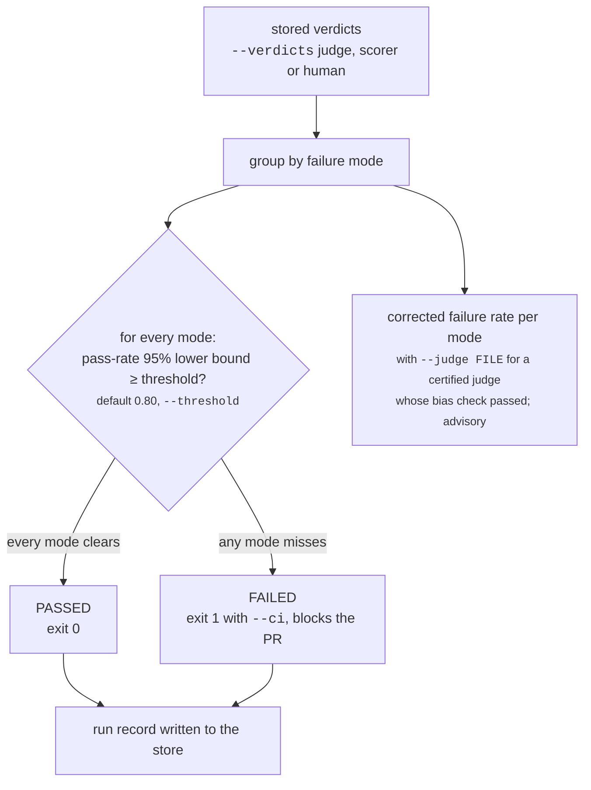

```mermaid
flowchart TD
    verdicts["stored verdicts<br/><code>--verdicts</code> judge, scorer or human"] --> group["group by failure mode"]
    group --> each{"for every mode:<br/>pass-rate 95% lower bound ≥ threshold?<br/><small>default 0.80, <code>--threshold</code></small>"}
    each -- "every mode clears" --> pass["PASSED<br/>exit 0"]
    each -- "any mode misses" --> fail["FAILED<br/>exit 1 with <code>--ci</code>, blocks the PR"]
    group --> trend["corrected failure rate per mode<br/><small>with <code>--judge FILE</code> for a certified judge<br/>whose bias check passed; advisory</small>"]
    pass --> record["run record written to the store"]
    fail --> record
```

