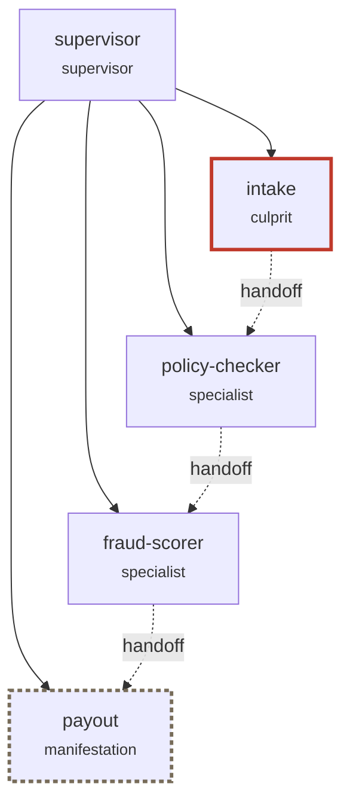

```mermaid
flowchart TD
  supervisor["supervisor<br/><small>supervisor</small>"]
  intake["intake<br/><small>culprit</small>"]
  policy_checker["policy-checker<br/><small>specialist</small>"]
  fraud_scorer["fraud-scorer<br/><small>specialist</small>"]
  payout["payout<br/><small>manifestation</small>"]
  supervisor --> intake
  supervisor --> policy_checker
  supervisor --> fraud_scorer
  supervisor --> payout
  intake -. handoff .-> policy_checker
  policy_checker -. handoff .-> fraud_scorer
  fraud_scorer -. handoff .-> payout
  classDef culprit stroke:#c0392b,stroke-width:3px
  classDef manifestation stroke:#776c59,stroke-width:3px,stroke-dasharray:4 3
  class intake culprit
  class payout manifestation
```
